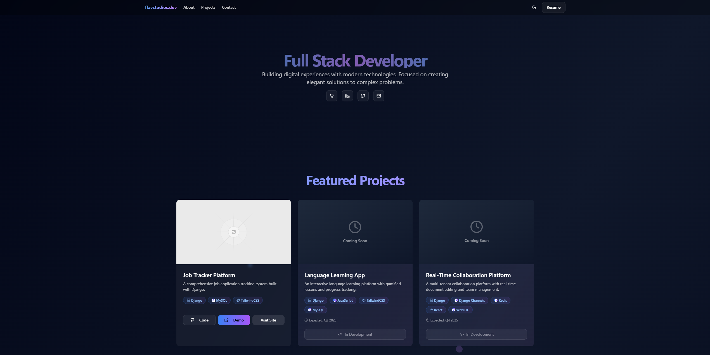
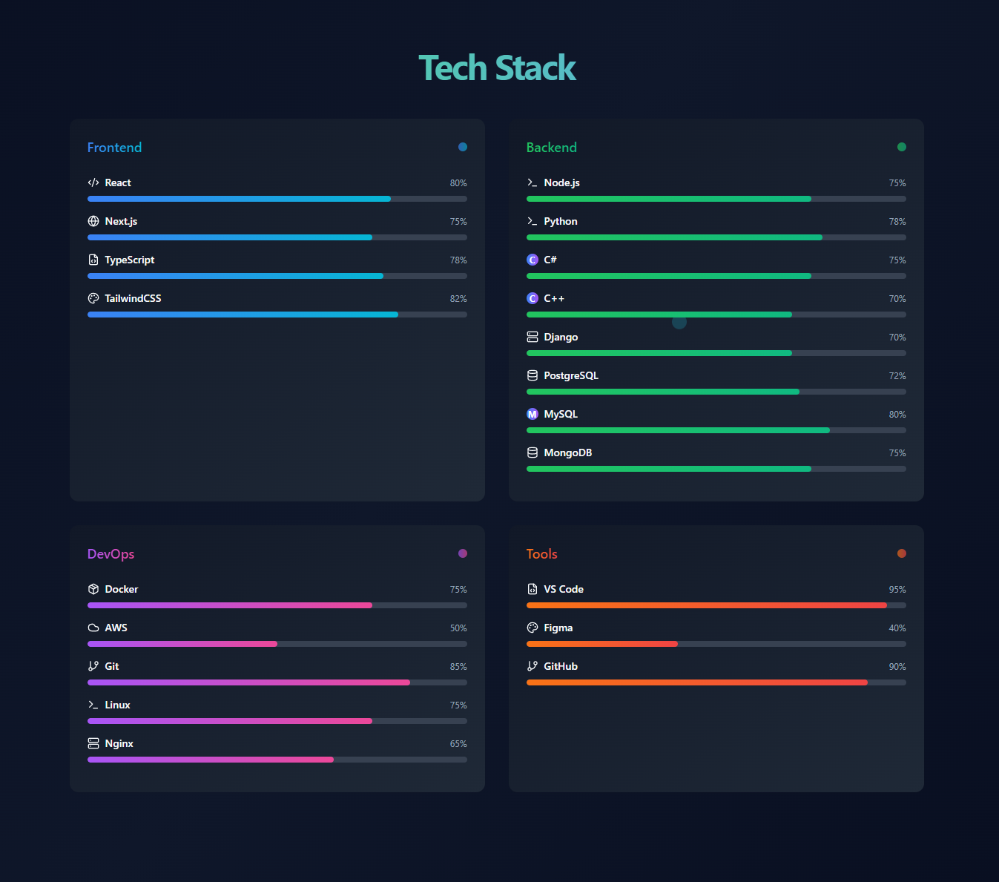
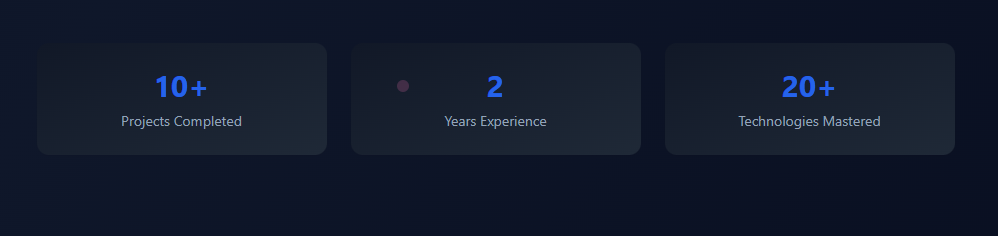
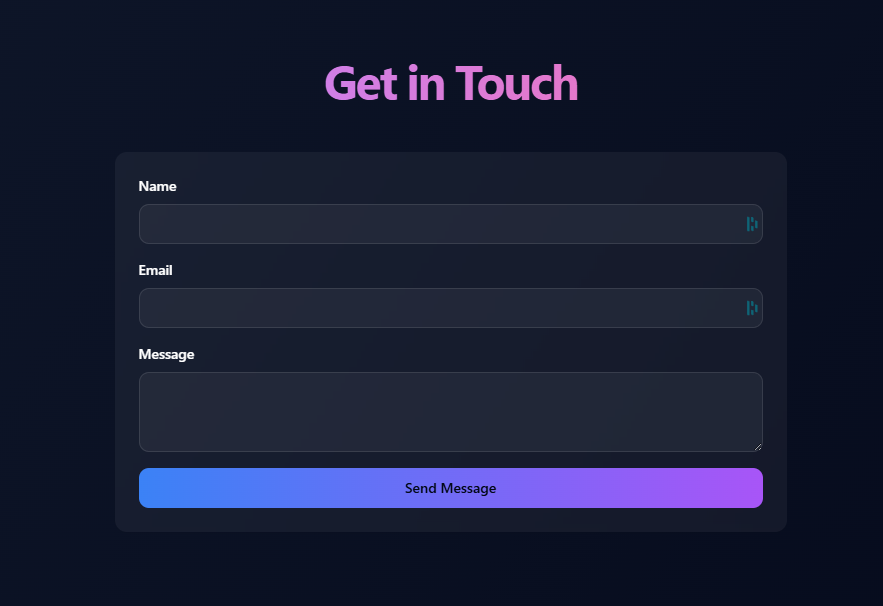

# 🎨 Flav Studios Landing Page

A sleek, responsive portfolio landing page built with Next.js, Tailwind CSS, and deployed on DigitalOcean. Showcases featured projects, tech stack, stats, and a contact form — complete with dark mode and PM2-managed production.

---

## 🚀 Table of Contents
1. [Demo & Screenshots](#demo--screenshots)  
2. [Features](#features)  
3. [Tech Stack](#tech-stack)  
4. [Project Structure](#project-structure)  
5. [Getting Started](#getting-started)  
   - [Prerequisites](#prerequisites)  
   - [Local Development](#local-development)  
6. [Deployment](#deployment)  
   - [PM2 & Nginx](#pm2--nginx)  
   - [SSL with Certbot](#ssl-with-certbot)  
7. [Customizations](#customizations)  
8. [Contact & Links](#contact--links)  

---

## Demo & Screenshots

> _Click any image to enlarge._

### Homepage – Hero & Featured Projects  


### Tech Stack & Stats Counters  
  


### Contact Form (Light / Dark Mode)  


---

## Features
- **Responsive Layout**: Mobile-first with Tailwind breakpoints.  
- **Dark Mode Toggle**: Automatically syncs with OS or manual switch.  
- **Featured Projects**: Cards with title, description, tech badges, GitHub link, “View Demo.”  
- **Tech Stack Section**: Lists Frontend, Backend, DevOps, Tools.  
- **Animated Counters**: Show “10+ Projects Completed,” “2 Years Experience,” etc.  
- **Contact Form**: Tailwind-styled with validation (UI only; integrate backend as needed).  
- **Resume Button**: Downloadable PDF link.  
- **SEO Optimized**: Proper meta tags, Open Graph, favicons.  
- **PM2-Managed Production**: Automatic restarts, log management.  
- **Nginx Reverse Proxy**: Hosts on `flavstudios.dev`; subdomains for apps.

---

## Tech Stack

| Layer      | Technologies                             |
|:-----------|:-----------------------------------------|
| Frontend   | Next.js (App Router), React              |
| Styling    | Tailwind CSS                             |
| Deployment | DigitalOcean VPS, Nginx, PM2             |
| CI/CD      | GitHub Actions (optional)                |
| Versioning | GitHub (branches: `dev`, `master`)       |

---

## Project Structure
```bash
flav-landing/
├── components/            # Reusable React + Tailwind UI components
│   ├── project-card.tsx
│   ├── tech-stack.tsx
│   └── contact-form.tsx
├── pages/                 # Next.js App Router pages
│   └── page.tsx
├── public/
│   └── images/            # Static assets
├── styles/                # Tailwind config & globals
├── package.json
├── tailwind.config.js
└── README.md
```

---

## Getting Started

### Prerequisites
- **Node.js** ≥ 18  
- **npm** or **yarn**  
- **Git**

### Local Development
1. **Clone & install**  
   
    ```bash
    git clone git@github.com:youruser/flav-landing.git
    cd flav-landing
    npm install
    ```

2. **Run dev server**  
   
    ```bash
    npm run dev
    ```

3. Open <http://localhost:3000> in your browser.

---

## Deployment

### PM2 & Nginx
1. **Build production assets**  
   
    ```bash
    npm run build
    ```

2. **Start with PM2**  
   
    ```bash
    pm2 start npm --name flav-landing -- start
    pm2 save
    pm2 startup
    ```

3. **Create Nginx vhost** – `/etc/nginx/sites-available/flav-landing`  
   
    ```nginx
    server {
      listen 80;
      server_name flavstudios.dev www.flavstudios.dev;

      location / {
        proxy_pass http://127.0.0.1:3000;
        include /etc/nginx/proxy_params;
      }
    }
    ```

4. **Enable & reload**  
   
    ```bash
    ln -s /etc/nginx/sites-available/flav-landing /etc/nginx/sites-enabled/
    nginx -t && systemctl reload nginx
    ```

### SSL with Certbot  
    ```bash
    certbot --nginx -d flavstudios.dev -d www.flavstudios.dev
    ```


## Customizations
- **Add / edit projects** – update `components/project-card.tsx` and data in `pages/page.tsx`.
- **Change color palette** – tweak `tailwind.config.js`.
- **Hook up contact form** – use Netlify Functions, Formspree, or your own API route.

---

## Contact & Links
- **GitHub:** <https://github.com/youruser/flav-landing>
- **Live Site:** <https://flavstudios.dev>
- **Author:** Flavius Porumbiel — [@ITsFlaviiFTW](https://github.com/ITsFlaviiFTW)
